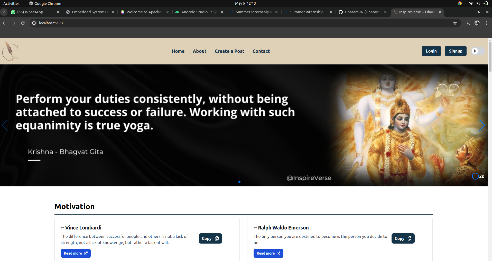
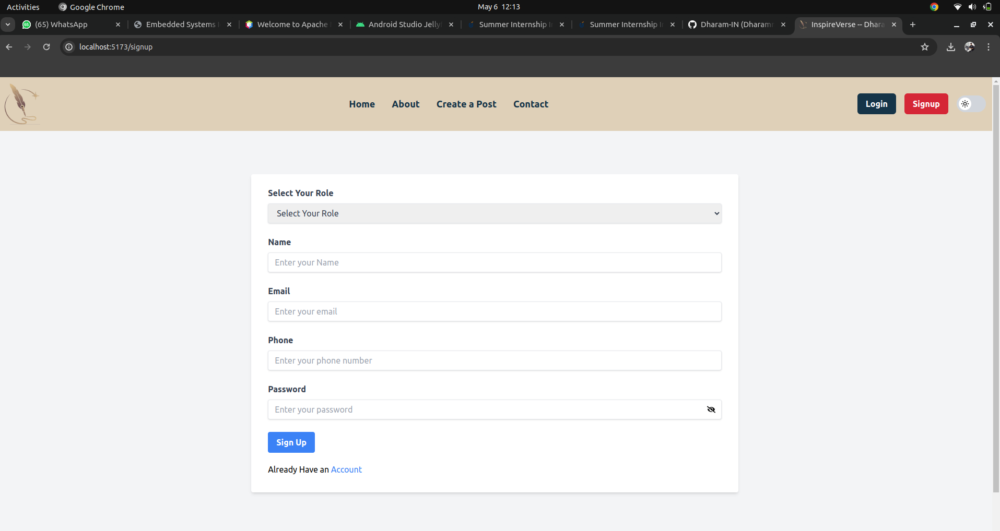
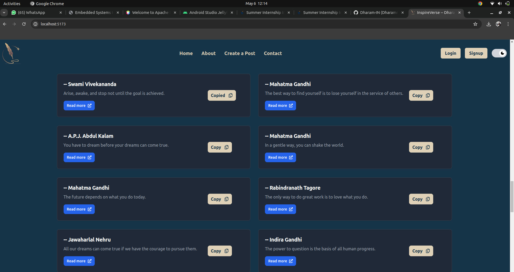
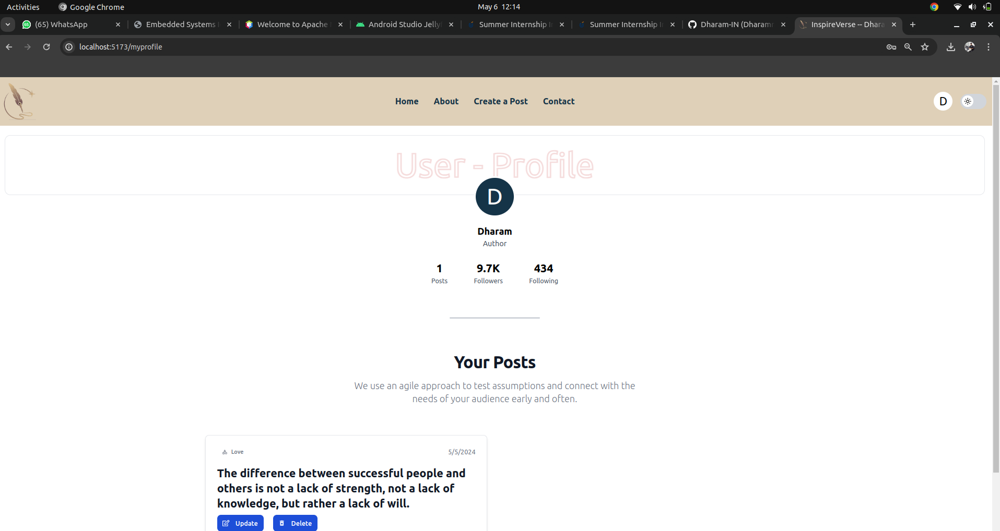

# InspireVerse

## Description
InspireVerse is a full-stack JavaScript project created to inspire and uplift users with motivational, love, and shayari quotes. It allows users to explore a curated collection of quotes and share their own inspirational thoughts. The project incorporates React for the frontend, Express.js and Node.js for the backend, and MongoDB for the database.

## Features
- **Quote Display:** Users can browse through a wide range of motivational, love, and shayari quotes.
- **User Registration:** Register to access additional features such as posting your own quotes.
- **Quote Submission:** Registered users can submit their own inspirational quotes to be featured on the platform.
- **Responsive Design:** InspireVerse is designed to provide a seamless experience across various devices.

## Technologies Used
- **React:** Frontend development for a dynamic user interface.
- **Express.js:** Backend framework for handling server-side operations.
- **Node.js:** JavaScript runtime for server-side development.
- **MongoDB:** NoSQL database for storing user data and quotes.
- **Tailwind:** Utilized for styling and creating a visually appealing user interface.

## Screenshot

## Usage
1. Explore the diverse collection of motivational, love, and shayari quotes.
2. Register to unlock the ability to post your own quotes and interact with the community.
3. Use the search functionality to find quotes that resonate with you.

## How to Run
1. Clone this repository to your local machine.
2. Navigate to the project directory in your terminal.
3. Install dependencies using `npm install`.
4. Start the server using `npm dev`.
5. Access the application in your web browser at `http://localhost:5173`.

## Credits
- Project developed by Dharam
- Special thanks to Hitesh Chaudhary and Harsh Bhaiya for their invaluable guidance in learning React and Node.js.
- Any additional resources used in the project.

Feel free to customize this readme file further according to your project's specifics and preferences.
